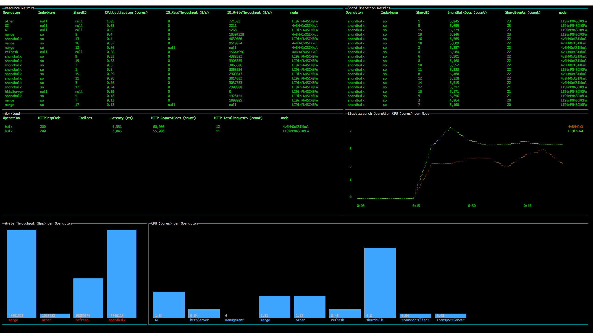
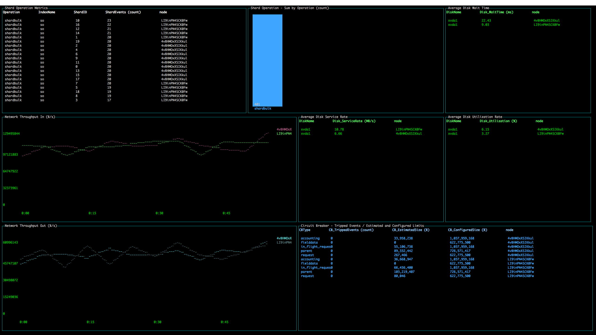
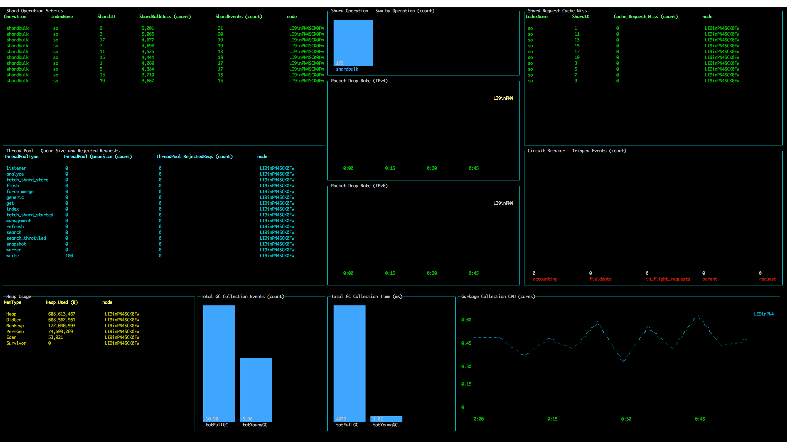

# PerfTop

The PerfTop CLI provides pre-configured dashboards for analyzing cluster, node, shard performance, and more. Use custom JSON templates to create the dashboards you need to diagnose your cluster performance.

## Documentation

For more information, see the [documentation](https://opendistro.github.io/for-elasticsearch-docs).


## Preset Dashboards

* All sorts are in decreasing order.
* Bar graphs show aggregated metrics on cluster-level unless stated otherwise.
* Line graphs generate random colors. If no data shows up, it's likely that the data is 0.

### ClusterOverview

This dashboard can be used to see what operations are running on cluster-level and on shard-level.
With this, users can measure which operation/node is consuming the most CPU and what latency the cluster is experiencing.

* "Resource Metrics" is sorted by CPU_Utilization.
* "Shard Operation Metrics" is sorted by ShardEvents.
* "Workload" is sorted by HTTP_RequestDocs.

### ClusterNetworkMemoryAnalysis

This dashboard shows shard-level operation, the network, and memory metrics.
It can be used to analyze which shard is doing the most workload, the amount of data being transmitted by the network,
which disk is performing poorly, and which circuit breaker type is experiencing OutOfMemory exceptions.

* "Shard Operation Metrics" is sorted by ShardEvents.
* "Circuit Breaker - Tripped Events / Estimated and Configured Limits" is sorted by CB_TrippedEvents.

### ClusterThreadAnalysis

This dashboard shows low-level metrics about threads/threadpools, which can be used to analyze
which threadpool type is rejecting operations due to its queue being too large,
which thread is running/waiting for too long and results in blocks,
and which thread operation is having issues with memory and is having to load it from the disk.

* "Thread Pool - Queue Size and Rejected Requests" is sorted by ThreadPool_RejectedReqs.
* "Thread - Blocked Time" is sorted by Thread_Blocked_Time.
* "Page Faults" is sorted by Paging_MajfltRate.
* All "Context Switch" tables are sorted by Sched_*.

### NodeAnalysis

This dashboard has the most wide ranges of metric types.
It shows shard-level operation metrics, thread metrics, JVM-related metrics
(e.g. heap usage, garbage collection), and network packet drop rate metrics.
After gaining some insights from the previous dashboards, users can specify which node to fetch metrics for.

This dashboard supports `--nodename $NODENAME` command-line argument for displaying metric data for
ONLY the node that starts with `$NODENAME`. If not provided, this dashboard will include all nodes.
Users can also define different node names for each type of graphs from the JSON dashboard config.

* "Shard Operation Metrics" is sorted by ShardEvents.
* "Shard Request Cache Miss" is sorted by Cache_Request_Miss.
* "Thread Pool - Queue Size and Rejected Requests" is sorted by ThreadPool_RejectedReqs.
* "Heap Usage" is sorted by Heap_Used.
* If no `--nodename $NODENAME` is provided, the bar graphs will be aggregated metrics on cluster-level.

## Download

Download the executables and preset JSON dashboard configs from
[link](https://opendistro.github.io/for-elasticsearch-docs).

Supported platforms: Linux, macOS

## Run

```
./perf-top-${PLATFORM} --dashboard $JSON --endpoint $ENDPOINT
```

## Build

Prerequisites:
- `node` (version >= v10.0 < v11.0)
- `npm`

1. Clone/download from Github
2. Run `./gradlew build`. This will run the following:
   1. `npm install` - locally installs dependencies
   2. `npm run build` - creates "perf-top-*" executables.
3. For cleaning, run `./gradlew clean` which will run:
   1. `npm run clean` - deletes locally installed dependencies and executables

To run PerfTop without (re)creating the executables every code change:
```
node ./bin.js --dashboard $JSON
```

## License

This tool is licensed under the Apache 2.0 License.

