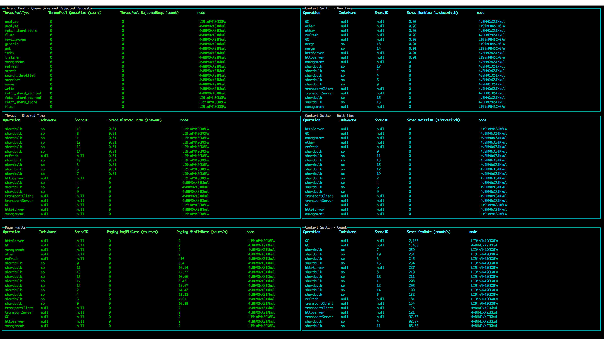

# PerfTop in NodeJS

PerfTop makes a HTTP request to  `<endpoint>/_performanceanalyzer/metrics`
and generates visualizations from the output.
Make sure your running environment has access to your endpoint.

Documentation: [LINK]

## Download

Download the executables and preset JSON dashboard configs from s3: [LINK]

Supported platforms: Linux, MacOS

## Demo Usage

### With Executables

```
./perf-top-${PLATFORM} --dashboard $JSON --endpoint $ENDPOINT
```
`--dashboard` argument can be passed in as the relative path to the JSON configuration file.
For preset dashboards, it can also be passed in as `ClusterOverview`, `ClusterPerformanceDiagnostic`,
`ClusterPerformanceInformational`, or `NodeAnalysis` instead of the JSON file path (e.g. `--dashboard ClusterOverview`).
For what each dashboard entails, refer to "Preset Dashboards" section.

From a cluster node with Performance Analyzer REST API on port 9600, set your `ENDPOINT` to `localhost:9600`.

For stderr logging, add `--logfile $logfile`.

For the preset `dashboards/NodeAnalysisDashboard.json`, pass in `--nodename $NODENAME` to configure your dashboard
to fetch metrics for a single node.

For exiting out of the screen, 'Escape', 'q', and 'Control-c' are supported.

### Without the Executables
Refer to "Development/Build And Usage" section.

## Preset Dashboards

* All sorts are in decreasing order.
* Bar graphs show aggregated metrics on cluster-level unless stated otherwise.
* Line graphs generate random colors. If no data shows up, it's likely that the data is 0.

### ClusterOverview

This dashboard can be used to see what operations are running on cluster-level and on shard-level.
With this, users can measure which operation/node is consuming the most CPU and what latency the cluster is experiencing.

* "Resource Metrics" is sorted by CPU_Utilization.
* "Shard Operation Metrics" is sorted by ShardEvents.
* "Workload" is sorted by HTTP_RequestDocs.

### ClusterNetworkMemoryAnalysis

This dashboard shows shard-level operation, the network, and memory metrics.
It can be used to analyze which shard is doing the most workload, the amount of data being transmitted by the network,
which disk is performing poorly, and which circuit breaker type is experiencing OutOfMemory exceptions.

* "Shard Operation Metrics" is sorted by ShardEvents.
* "Circuit Breaker - Tripped Events / Estimated and Configured Limits" is sorted by CB_TrippedEvents.

### ClusterThreadAnalysis

This dashboard shows low-level metrics about threads/threadpools, which can be used to analyze
which threadpool type is rejecting operations due to its queue being too large,
which thread is running/waiting for too long and results in blocks,
and which thread operation is having issues with memory and is having to load it from the disk.

* "Thread Pool - Queue Size and Rejected Requests" is sorted by ThreadPool_RejectedReqs.
* "Thread - Blocked Time" is sorted by Thread_Blocked_Time.
* "Page Faults" is sorted by Paging_MajfltRate.
* All "Context Switch" tables are sorted by Sched_*.

### NodeAnalysis

This dashboard has the most wide ranges of metric types.
It shows shard-level operation metrics, thread metrics, JVM-related metrics
(e.g. heap usage, garbage collection), and network packet drop rate metrics.
After gaining some insights from the previous dashboards, users can specify which node to fetch metrics for.

This dashboard supports `--nodename $NODENAME` command-line argument for displaying metric data for
ONLY the node that starts with `$NODENAME`. If not provided, this dashboard will include all nodes.
Users can also define different node names for each type of graphs from the JSON dashboard config.

* "Shard Operation Metrics" is sorted by ShardEvents.
* "Shard Request Cache Miss" is sorted by Cache_Request_Miss.
* "Thread Pool - Queue Size and Rejected Requests" is sorted by ThreadPool_RejectedReqs.
* "Heap Usage" is sorted by Heap_Used.
* If no `--nodename $NODENAME` is provided, the bar graphs will be aggregated metrics on cluster-level.

## Development

### Requirements
- `node` (version >= v10.0 < v11.0)
- `npm`

### Build and Usage
1. Clone/download from Github
2. Run `./gradlew build`. This will run the following:
   1. `npm install` - locally installs dependencies
   2. `npm run build` - creates "perf-top-*" executables
3. For cleaning, run `./gradlew clean` which will run:
   1. `npm run clean` - deletes locally installed dependencies and executables

To run PerfTop without (re)creating the executables every code change:
```
node ./bin.js --dashboard $JSON
```

## Configuration (JSON)

### Supported Fields
- `endpoint` - Define the endpoint for PerfTop. This can be provided via command line argument.
- `graphs` - For each `tables`, `bars`, and `lines`
  - `queryParams` - Parameters for the HTTP request to fetch data from your endpoint
    - `metrics` (required) - For bar and line graphs, query for ONE metric that would return a numeric value
    - `aggregates` (required)
    - `dimensions` (required)
    - `dimensionFilters` (optional) - Array of dimension values to fetch for.
    - `nodeName` (optional) - The name of the node. PerfTop will do a "startswith" check on this. This can be "#nodeName" and be replaced by the `--nodename $NODE_NAME` command line argument.
    - `sortBy` - In decreasing order. Required for tables only.
  - `gridOptions` - For auto-positioning the graphs. Define `rows` and `cols` with a numeric value. The `gridPosition` will base off on these values.
  - `options` - Graph object options.
    - `gridPosition` (required) - Defines the position of your graph.
    - `refreshInterval` (required) - How frequently your graph will generate new data (in milliseconds).
    - Refer to the [blessed library](https://github.com/chjj/blessed) and
[blessed-contrib library](https://github.com/yaronn/blessed-contrib) for the other options.
